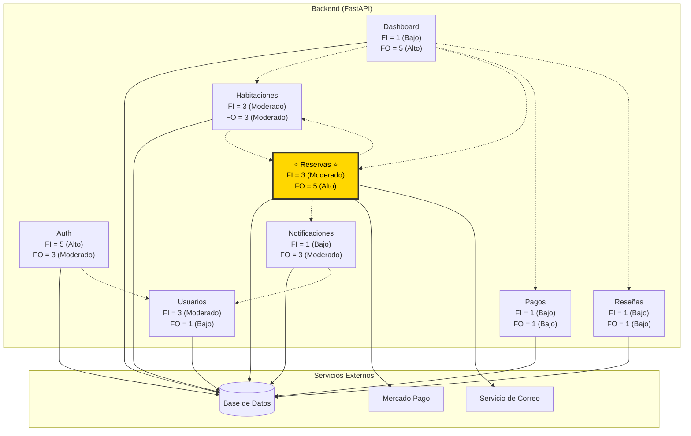

# Análisis de Fan-In y Fan-Out — Hotel Nova

## Diagrama General de Dependencias



**Nota sobre el diagrama:**
- Las flechas continuas (→) indican dependencia directa.
- Las flechas punteadas (-.-) indican dependencia vía CRUD o lectura de modelos compartidos.
- El módulo **Reservas** está resaltado (⭐) por ser el más complejo del sistema.

---

## Tabla de Fan-In y Fan-Out por Módulo

| MÓDULO | FAN-IN | FAN-OUT | INTERPRETACIÓN MEJORADA |
|--------|--------|---------|-------------------------|
| **Auth** | Alto (5/5) | Moderado (3/5) | Módulo de control de acceso transversal. Su alto fan-in indica que es una dependencia crítica: si falla, todos los demás módulos del sistema quedan sin acceso. Depende de la base de datos y del módulo Usuarios para validar credenciales y generar tokens JWT. |
| **Habitaciones** | Moderado (3/5) | Moderado (3/5) | Módulo equilibrado. Es llamado por el usuario y por el módulo de Reservas para verificar disponibilidad de habitaciones. Depende de la base de datos y consulta al módulo Reservas para validar solapamiento de fechas. No representa un cuello de botella significativo. |
| **Reservas** ⭐ | Moderado (3/5) | **Alto (5/5)** | **El módulo más acoplado del sistema.** Fan-in moderado porque Habitaciones y Dashboard dependen de sus datos. Fan-out alto porque depende de 5 módulos internos y externos (Base de Datos, Habitaciones, Notificaciones, Mercado Pago, Servicio de Correo). Esta combinación de dependencias de escritura con servicios externos lo convierte en el mayor riesgo de fallo en cascada del sistema. |
| **Pagos** | Bajo (1/5) | Bajo (1/5) | Módulo de consulta sencillo. Baja complejidad interna. Solo permite listar y registrar pagos. El procesamiento real de pagos ocurre dentro del módulo Reservas vía Mercado Pago. |
| **Notificaciones** | Bajo (1/5) | Moderado (3/5) | Módulo de responsabilidad específica. Su fan-in bajo indica que solo Reservas lo invoca. Depende de la base de datos y del módulo Usuarios para gestionar los destinatarios. |
| **Usuarios** | Moderado (3/5) | Bajo (1/5) | Módulo de datos compartido. Su fan-in moderado significa que Auth y Notificaciones lo utilizan para consultar y gestionar usuarios. Internamente simple porque solo interactúa con la base de datos. |
| **Reseñas** | Bajo (1/5) | Bajo (1/5) | Módulo aislado y autónomo. Permite a los huéspedes dejar reseñas. Bajo impacto en caso de fallo. Sus dependencias se limitan a la base de datos. |
| **Dashboard** | Bajo (1/5) | Alto (5/5) | Módulo puramente consultivo. Alto fan-out porque agrega datos de múltiples módulos (Habitaciones, Reservas, Pagos, Reseñas), pero solo una interfaz administrativa depende de él. Si falla, solo afecta las visualizaciones del panel, no las operaciones del negocio. |

---

## Determinación del Módulo Más Complejo

**Reservas** es el módulo más complejo por las siguientes razones:

1. **Único módulo con Fan-Out Alto (5/5) y Fan-In Moderado (3/5) simultáneamente**: mientras que Dashboard también tiene Fan-Out alto, su Fan-In es bajo (solo el frontend lo consume). Reservas, en cambio, es utilizado por otros módulos del sistema **y** depende de varios módulos y servicios externos.

2. **Responsabilidades múltiples en un solo archivo** (`routers/reservas.py`):
   - Creación y gestión de reservas
   - Integración con Mercado Pago (crear preferencia, verificar pago, webhook)
   - Envío de correos de confirmación vía SMTP
   - Registro de pagos aprobados
   - Operaciones de check-in, check-out, cancelación
   - Notificaciones internas al cancelar reservas

3. **Dependencias híbridas**: combina dependencias de escritura sobre otros módulos (Habitaciones, Notificaciones) con servicios externos transaccionales (Mercado Pago para pagos, SMTP para correos). Un fallo en cualquiera de estos puede dejar el sistema en estado inconsistente.

4. **Acoplamiento bidireccional**: Habitaciones depende de Reservas (para verificar overlap) y Reservas depende de Habitaciones (para actualizar estado). Esto crea un ciclo de dependencia que aumenta la fragilidad.

### Riesgos si el Módulo Falla

- Caída total de la funcionalidad principal del hotel (no se pueden crear ni gestionar reservas).
- Pérdida de ingresos al no poder procesar pagos vía Mercado Pago.
- Inconsistencia de datos si el webhook de Mercado Pago recibe pagos pero no actualiza el sistema.
- Huéspedes sin confirmación de reserva por fallo en el envío de correos.

---

## Plan B — Contingencia a Corto Plazo

1. **Endpoints administrativos de respaldo**: implementar endpoints manuales en el panel de administración para crear reservas y registrar pagos en efectivo sin depender de Mercado Pago.
2. **Health Checks**: monitorear el estado de Mercado Pago y SMTP. Si están caídos, deshabilitar preventivamente las operaciones que los requieran con mensajes claros al usuario.
3. **Cola de reintentos**: las operaciones con servicios externos (webhook, correo) deben encolarse con reintentos exponenciales en lugar de ejecutarse sincrónicamente.

---

## Solución a Largo Plazo

1. **Arquitectura de Eventos**: reemplazar llamadas directas a `EmailService` y `crud/notificacion` por eventos en una cola (Redis/Celery). La creación de una reserva publica un evento; los suscriptores reaccionan asíncronamente.
2. **Circuit Breaker** para llamadas a Mercado Pago: si el servicio externo falla N veces consecutivas, se evitan llamadas adicionales durante un período.
3. **Descomposición del módulo**: dividir `routers/reservas.py` en submódulos especializados:
   ```
   routers/reservas/
     ├── crud.py           → CRUD básico (crear, listar, cancelar)
     ├── checkout.py       → Check-in, check-out, liberar, completar
     ├── pagos_mp.py       → Integración con Mercado Pago
     └── notificaciones.py → Envío de correos y notificaciones
   ```
4. **Base de Datos como fuente de verdad**: persistir todos los estados transaccionales antes de cualquier operación externa, permitiendo reconciliación posterior ante fallos.

---

## Conclusión Técnica

El análisis de Fan-In y Fan-Out revela que el módulo **Reservas** concentra el mayor riesgo arquitectónico del sistema Hotel Nova. Con un Fan-Out Alto (5/5) y un Fan-In Moderado (3/5), es el único módulo que combina un alto nivel de dependencias salientes con una relevancia funcional significativa para otros módulos. Esta dualidad, junto con su responsabilidad de gestionar transacciones críticas (pagos, correos, cambios de estado), lo convierte en el punto de fallo más crítico del sistema. Se recomienda priorizar su descomposición en submódulos y la adopción de una arquitectura orientada a eventos para reducir el acoplamiento y mejorar la resiliencia general.
